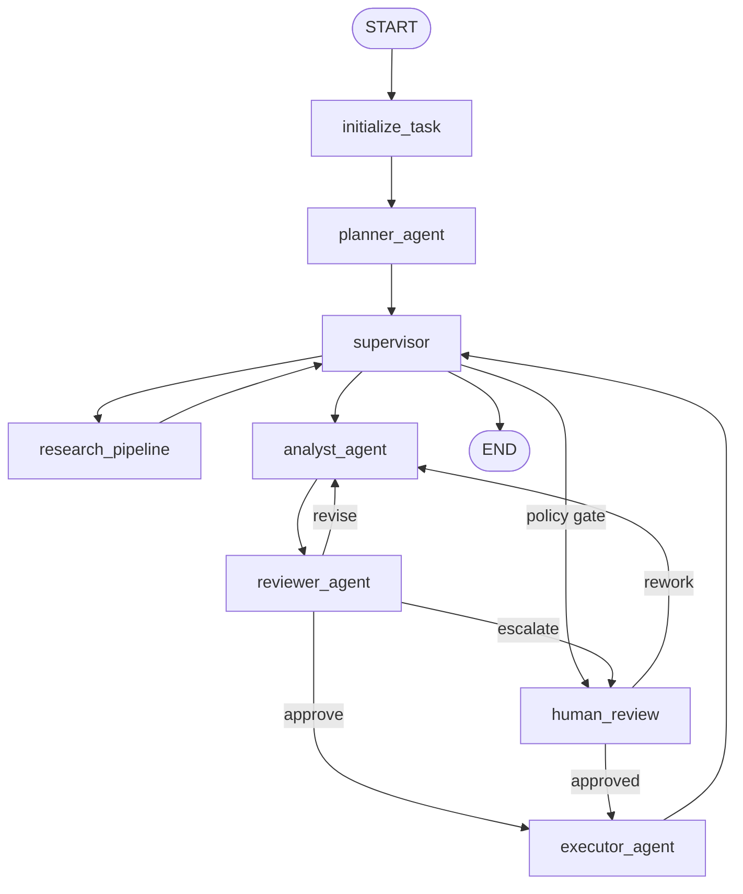

# LangGraph AgentOps Studio

[中文文档](README_zh.md)

LangGraph AgentOps Studio is a LangGraph-native AgentOps workbench for multi-agent research workflows, evidence assessment, recommendation synthesis, policy governance, and auditable artifact export.

## Core Capabilities

- Graph-based orchestration with `StateGraph`, `ToolNode`, `Command`, `interrupt`, and checkpoint-backed resume semantics.
- Role-based multi-agent workflow: planner, research pipeline, analyst, reviewer, HITL approval gate, executor, and supervisor.
- Provider-managed LLM and embedding clients (`openai`, `deepseek`, `openai_compatible`).
- Hybrid evidence grounding across vector retrieval and web evidence sources (Tavily + Jina, or Exa search + content extraction).
- Evidence assessment pipeline with structured scoring dimensions, support/contradiction analysis, and coverage measurement.
- Evidence-grounded recommendation synthesis with confidence scoring, open questions, and residual risk outputs.
- Policy-based governance evaluation with explicit escalation criteria for human review.
- Auditable artifact set (`final_report.md`, `decision_record.json`, `workflow_trace.json`, `run_artifact.json`, and supporting files).
- Web console for run submission, interrupt review, provider inspection, and artifact path discovery.

## Workflow Topology



## Quick Start

```bash
python -m venv .venv
source .venv/bin/activate
pip install -e ".[dev]"
cp .env.example .env
```

## Configuration

Start by copying `.env.example` to `.env`. Configure the variables required for the execution mode you intend to use, then enable optional capabilities incrementally.

### Minimum Configuration

For CLI or API execution, configure one LLM provider:

- `LLM_PROVIDER`: `openai`, `deepseek`, or `openai_compatible`.
- `LLM_MODEL`: the chat completion model used by the workflow.
- `LLM_API_KEY`: the provider API key.
- `LLM_BASE_URL`: required for OpenAI-compatible gateways or custom endpoints; leave empty for the provider default.

Configure one embedding provider as well. The runtime initializes the embedding client even when live web search is disabled:

- `EMBEDDING_PROVIDER`: `openai`, `deepseek`, or `openai_compatible`.
- `EMBEDDING_MODEL`: the text embedding model.
- `EMBEDDING_API_KEY`: the embedding provider API key.
- `EMBEDDING_BASE_URL`: required for OpenAI-compatible gateways or custom endpoints; leave empty for the provider default.

For the web frontend, configure:

- Backend `.env`: `CORS_ORIGINS=http://127.0.0.1:5173,http://localhost:5173`.
- Frontend `web/.env`: `VITE_API_BASE_URL=http://127.0.0.1:8000`.

No remote vector database is required for local development. The default vector store uses embedded Qdrant local storage through `QDRANT_LOCAL_PATH=.qdrant`.

### Optional Configuration

- Application and runtime controls: `APP_NAME`, `LOG_LEVEL`, `OUTPUT_ROOT`, `CHECKPOINT_MODE`, `MAX_RETRIES`, `MAX_REVISIONS`.
- Remote Qdrant: set `VECTOR_DB_PROVIDER=qdrant`, `QDRANT_URL`, `QDRANT_API_KEY`, and `QDRANT_COLLECTION` only when using a hosted Qdrant instance.
- Local vector retrieval behavior: tune `RAG_SOURCE_DIR`, `RAG_TOP_K`, `RAG_CHUNK_SIZE`, `RAG_CHUNK_OVERLAP`, and `RAG_SCORE_THRESHOLD`.
- Web evidence grounding: set `ENABLE_WEB_SEARCH=true` and provide either `TAVILY_API_KEY` or `EXA_API_KEY` when live web search is required. The default example keeps `ENABLE_WEB_SEARCH=false` so local runs do not depend on external search or reader providers.
- Tavily + Jina mode: configure `WEB_SEARCH_MODE=tavily_jina`, `TAVILY_*`, and optionally `JINA_*` reader settings.
- Exa mode: configure `WEB_SEARCH_MODE=exa`, `EXA_*`, and `EXA_USE_CONTENTS`.
- Governance policy thresholds: tune `GOVERNANCE_*`, `RISK_THRESHOLD_FOR_HUMAN_REVIEW`, and `GOVERNANCE_MANUAL_APPROVAL_POLICY_BY_TASK_TYPE_JSON`.

## Build the Vector Index

```bash
python app/ingest.py --source-dir examples/knowledge_base --recreate-collection
```

## Usage

### 1. CLI Mode

Run a workflow from an inline task:

```bash
python app/main.py \
  --task "Evaluate orchestration patterns for a regulated platform migration plan." \
  --task-type architecture \
  --auto-approve
```

Run a workflow from a task file:

```bash
python app/main.py \
  --task-file examples/compare_platforms.json \
  --task-type architecture
```

When `--auto-approve` is omitted, high-risk workflows can pause at the HITL approval gate. Resume those runs through the API or the web frontend.

### 2. API Mode

Start the FastAPI server:

```bash
.venv/bin/uvicorn app.api:app --reload
```

Check service health and active providers:

```bash
curl http://127.0.0.1:8000/health
curl http://127.0.0.1:8000/providers
```

Create a run:

```bash
curl -X POST http://127.0.0.1:8000/runs \
  -H "Content-Type: application/json" \
  -d '{"task":"Evaluate governance controls for a multi-agent platform.","task_type":"architecture","auto_approve":true}'
```

Resume a run after an approval interrupt:

```bash
curl -X POST http://127.0.0.1:8000/runs/<task_id>/continue \
  -H "Content-Type: application/json" \
  -d '{"approved":true,"reviewer":"ops-reviewer","rationale":"Policy checks satisfied."}'
```

Ingest local knowledge-base documents:

```bash
curl -X POST http://127.0.0.1:8000/ingest \
  -H "Content-Type: application/json" \
  -d '{"source_dir":"examples/knowledge_base","recreate_collection":true}'
```

### 3. Web Frontend Mode

Start the backend:

```bash
.venv/bin/uvicorn app.api:app --reload
```

Start the frontend in another terminal:

```bash
cd web
npm install
cp .env.example .env
npm run dev
```

Open:

```text
http://127.0.0.1:5173
```

The frontend connects to the backend through `VITE_API_BASE_URL` in `web/.env`.

```env
VITE_API_BASE_URL=http://127.0.0.1:8000
```

The current API does not expose a dedicated run-status polling endpoint. The web frontend displays the latest response returned by create-run or continue-run requests.

## Run Outputs

Completed workflow artifacts are persisted under:

```text
runs/<task_id>/
```

The artifact root is controlled by `OUTPUT_ROOT=runs` in `.env`. For example, a run with task ID `demo-run` writes files to:

```text
runs/demo-run/
```

Final output files include:

- `final_report.md`: reviewer-facing recommendation report.
- `decision_record.json`: compact decision record for downstream governance review.
- `workflow_trace.json`: chronological workflow execution trace.
- `run_artifact.json`: structured artifact manifest with selected state and decision data.
- `state_snapshot.json`: serialized workflow state snapshot for audit and replay.

If a run pauses at the HITL approval gate, final artifacts are not complete until the run is resumed and reaches the executor. The API and web frontend also return `artifact_paths` after artifacts are exported.

## Interface Overview

<p align="center">
  
</p>

<p align="center">
  
</p>

## Web Frontend

The `web/` application provides a glassmorphism AgentOps control plane with:

- task submission with task-type classification (`general`, `architecture`, `security`, `finance`);
- an auto-approval switch for demonstration runs;
- backend health checks and provider status inspection;
- run result snapshots with task ID, lifecycle status, provider details, review summary, decision context, artifact paths, and raw JSON;
- a human review panel for approving or rejecting interrupted runs.

## Web Directory Structure

```text
web/
  package.json
  index.html
  vite.config.ts
  tsconfig.json
  .env.example
  README.md
  src/
    main.tsx
    App.tsx
    api/
      client.ts
    components/
      ...
    styles/
      ...
```

## Testing

Deterministic unit tests:

```bash
pytest tests/test_config.py tests/test_evidence_pipeline.py tests/test_governance.py tests/test_grounding_merge.py
```

Integration smoke tests (network access + provider credentials):

```bash
RUN_REAL_WEB_GROUNDING=1 pytest tests/integration/test_real_web_grounding.py
RUN_REAL_PROVIDER_RUN=1 pytest tests/integration/test_real_provider_run.py
```

Integration tests are env-gated and skip when required keys are not present.

Backend bytecode compilation check:

```bash
python -m compileall app agents graph services tools schemas config artifacts
```

Frontend production build:

```bash
cd web
npm install
npm run build
```

## Troubleshooting

- Frontend cannot connect to the API: verify `VITE_API_BASE_URL` in `web/.env` and `CORS_ORIGINS` in the backend environment. The default backend CORS origins include `http://127.0.0.1:5173` and `http://localhost:5173`.
- Run creation fails: verify LLM, embedding, and web search API keys in `.env`.
- No Tavily or Exa key is available: set `ENABLE_WEB_SEARCH=false` to run without live web search.
- A high-risk task triggers human approval: enable `--auto-approve`, set `auto_approve=true`, or resume through `/runs/{task_id}/continue` or the web frontend review panel.

## Documentation

- `docs/architecture.md`
- `docs/providers.md`
- `docs/rag.md`
- `docs/web_search.md`
- `docs/evidence.md`
- `docs/governance.md`
- `docs/testing.md`

## License

MIT (`LICENSE`).
