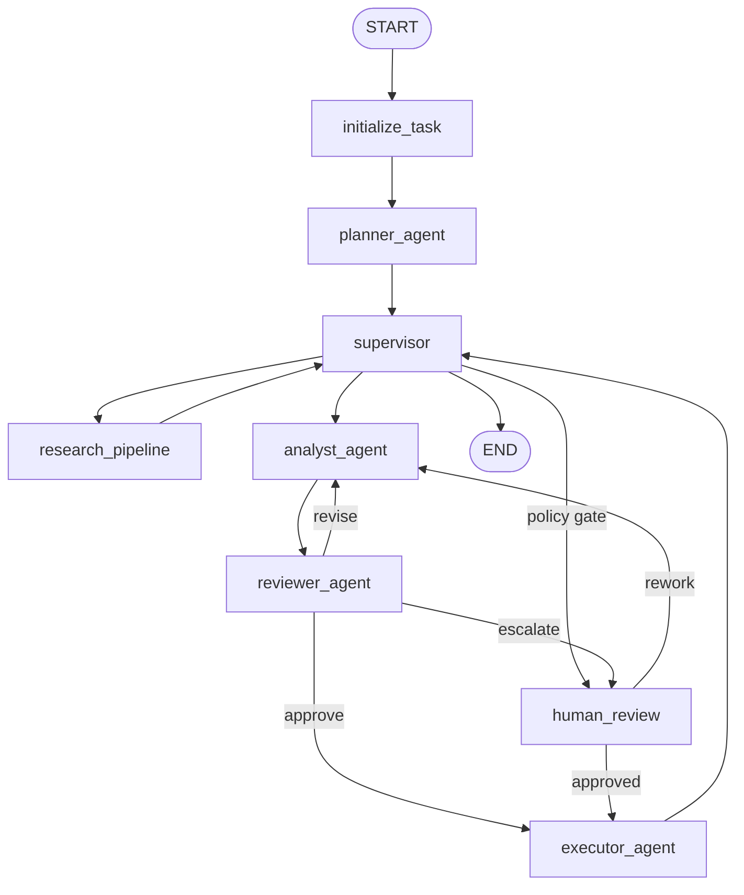
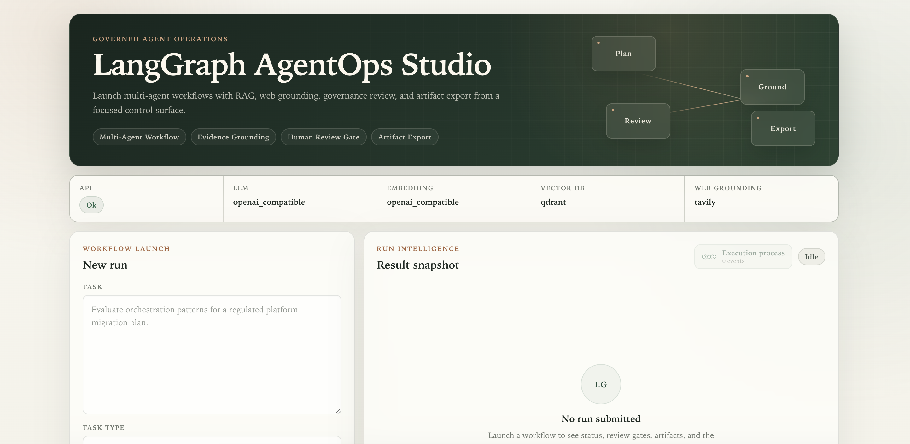
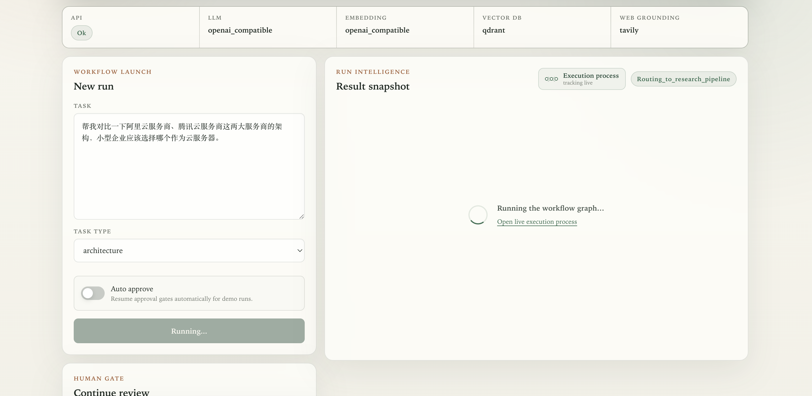
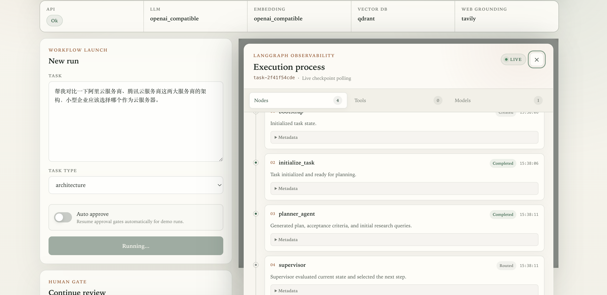
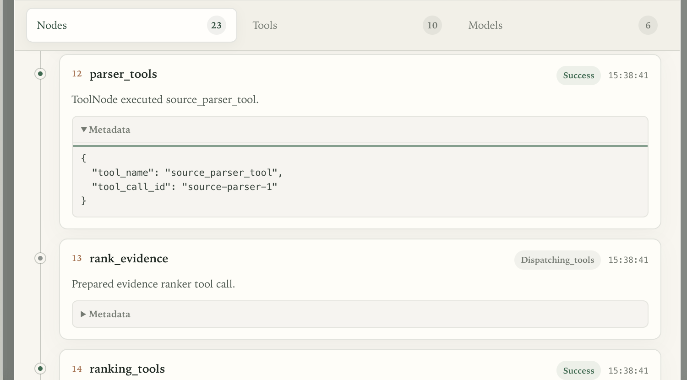
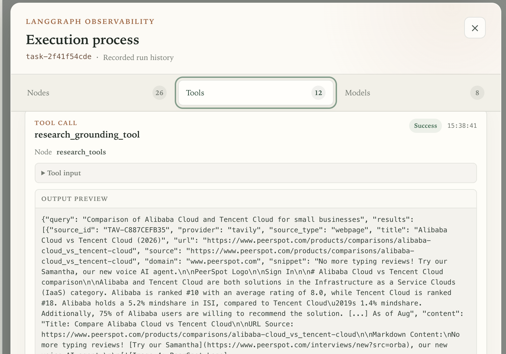
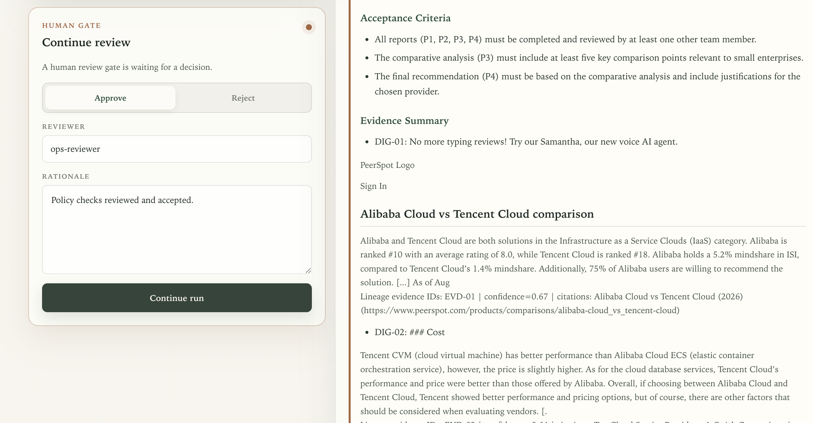

# LangGraph AgentOps Studio

[English README](README.md)

LangGraph AgentOps Studio 是一个基于 LangGraph 原生能力构建的 AgentOps 工作台，用于多智能体研究工作流、证据评估、建议综合、策略治理和可审计工件导出。

## 核心能力

- 基于图的编排，使用 `StateGraph`、`ToolNode`、`Command`、`interrupt` 和检查点支持的恢复语义。
- 基于角色的多智能体工作流：规划器、研究流水线、分析员、审阅员、HITL 审批关口、执行器和监督器。
- Provider 托管的 LLM 与 Embedding 客户端（`openai`、`deepseek`、`openai_compatible`）。
- 混合式证据 grounding，覆盖向量检索和 Web 证据源（Tavily + Jina，或 Exa search + content extraction）。
- 证据评估流水线，包含结构化评分维度、支持/矛盾分析和覆盖度度量。
- 基于证据 grounding 的建议综合，输出置信度评分、开放问题和残余风险。
- 基于策略的治理评估，提供明确的人工审阅升级标准。
- 基于检查点的前端进度查询，展示节点轨迹、真实工具/模型调用以及模型输出预览。
- 可审计工件集合（`final_report.md`、`decision_record.json`、`workflow_trace.json`、`run_artifact.json` 以及支持文件）。
- Web 控制台，用于提交运行、审阅中断、检查 Provider 和发现工件路径。

## 工作流拓扑


```mermaid
flowchart TD
    START([START]) --> init[initialize_task]
    init --> planner[planner_agent]
    planner --> supervisor[supervisor]
    supervisor --> research[research_pipeline]
    research --> supervisor
    supervisor --> analyst[analyst_agent]
    supervisor -->|policy gate| hitl[human_review]
    analyst --> reviewer[reviewer_agent]
    reviewer -->|revise| analyst
    reviewer -->|escalate| hitl
    reviewer -->|approve| executor[executor_agent]
    hitl -->|approved| executor
    hitl -->|rework| analyst
    executor --> supervisor
    supervisor --> END([END])
```

## 快速开始

```bash
python -m venv .venv
source .venv/bin/activate
pip install -e ".[dev]"
cp .env.example .env
```

## 配置

先将 `.env.example` 复制为 `.env`。配置目标执行模式所需的变量，再逐步启用可选能力。

### 最小配置

对于 CLI 或 API 执行，配置一个 LLM Provider：

- `LLM_PROVIDER`：`openai`、`deepseek` 或 `openai_compatible`。
- `LLM_MODEL`：工作流使用的 Chat Completion 模型。
- `LLM_API_KEY`：Provider API Key。
- `LLM_BASE_URL`：使用 OpenAI-compatible 网关或自定义端点时必填；使用 Provider 默认地址时留空。

同时配置一个 Embedding Provider。当前 runtime 即使在关闭实时 Web Search 时也会初始化 Embedding 客户端：

- `EMBEDDING_PROVIDER`：`openai`、`deepseek` 或 `openai_compatible`。
- `EMBEDDING_MODEL`：文本 Embedding 模型。
- `EMBEDDING_API_KEY`：Embedding Provider API Key。
- `EMBEDDING_BASE_URL`：使用 OpenAI-compatible 网关或自定义端点时必填；使用 Provider 默认地址时留空。

对于 Web 前端，配置：

- 后端 `.env`：`CORS_ORIGINS=http://127.0.0.1:5173,http://localhost:5173`。
- 前端 `web/.env`：`VITE_API_BASE_URL=http://127.0.0.1:8000`。

本地开发不需要远程向量数据库。默认向量库通过 `QDRANT_LOCAL_PATH=.qdrant` 使用嵌入式 Qdrant 本地存储。

### 可选配置

- 应用和运行时控制项：`APP_NAME`、`LOG_LEVEL`、`OUTPUT_ROOT`、`CHECKPOINT_MODE`、`MAX_RETRIES`、`MAX_REVISIONS`。
- 详细结论控制项：`REPORT_DETAIL_LEVEL`、`REPORT_MAX_FINDINGS_IN_CONCLUSION`、`REPORT_MAX_EVIDENCE_IN_CONCLUSION`、`REPORT_MAX_RISKS_IN_CONCLUSION` 和 `REPORT_INCLUDE_NEXT_ACTIONS`。
- 向量存储：`VECTOR_DB_PROVIDER` 支持 Qdrant、Milvus、Weaviate、Chroma、pgvector、Pinecone 和测试用内存后端。Qdrant 仍是默认选项；其他客户端通过可选 extra 安装（例如 `pip install -e ".[milvus]"`），后端变量见 `docs/providers.md`。
- 本地向量检索行为：调优 `RAG_SOURCE_DIR`、`RAG_TOP_K`、`RAG_CHUNK_SIZE`、`RAG_CHUNK_OVERLAP` 和 `RAG_SCORE_THRESHOLD`。
- Web 证据 grounding：需要实时联网搜索时，设置 `ENABLE_WEB_SEARCH=true` 并提供 `TAVILY_API_KEY` 或 `EXA_API_KEY`。默认示例保持 `ENABLE_WEB_SEARCH=false`，避免本地运行依赖外部搜索或 reader provider。
- 网络代理：如果联网搜索或页面读取卡顿、被阻断或超时，可以在后端 `.env` 中配置 `HTTP_PROXY` 和 `HTTPS_PROXY`，例如 `HTTP_PROXY=http://127.0.0.1:7890`。
- Tavily + Jina 模式：配置 `WEB_SEARCH_MODE=tavily_jina`、`TAVILY_*`，并可选配置 `JINA_*` reader 设置。
- Exa 模式：配置 `WEB_SEARCH_MODE=exa`、`EXA_*` 和 `EXA_USE_CONTENTS`。
- 治理策略阈值：调优 `GOVERNANCE_*`、`RISK_THRESHOLD_FOR_HUMAN_REVIEW` 和 `GOVERNANCE_MANUAL_APPROVAL_POLICY_BY_TASK_TYPE_JSON`。

## 构建向量索引

```bash
python app/ingest.py --source-dir examples/knowledge_base --recreate-collection
```

## 使用方式

### 1. CLI 模式

从内联任务运行工作流：

```bash
python app/main.py \
  --task "Evaluate orchestration patterns for a regulated platform migration plan." \
  --task-type architecture \
  --auto-approve
```

从任务文件运行工作流：

```bash
python app/main.py \
  --task-file examples/compare_platforms.json \
  --task-type architecture
```

省略 `--auto-approve` 时，高风险工作流可能会在 HITL 审批关口暂停。可通过 API 或 Web 前端恢复这些运行。

### 2. API 模式

启动 FastAPI 服务器：

```bash
.venv/bin/uvicorn app.api:app --reload
```

检查服务健康状态和当前 Provider：

```bash
curl http://127.0.0.1:8000/health
curl http://127.0.0.1:8000/providers
```

创建运行：

```bash
curl -X POST http://127.0.0.1:8000/runs \
  -H "Content-Type: application/json" \
  -d '{"task":"Evaluate governance controls for a multi-agent platform.","task_type":"architecture","auto_approve":true}'
```

POST 尚在执行时查询最新 LangGraph 检查点（创建请求中需使用前端预先生成的
`task_id`）：

```bash
curl http://127.0.0.1:8000/runs/<task_id>
```

响应包含 `execution_trace`、`tool_call_history`、`model_call_history`、
`next_nodes`、`draft_report` 和 `final_report`。精确轮询契约见
[`docs/observability.md`](docs/observability.md)。

在审批中断后恢复运行：

```bash
curl -X POST http://127.0.0.1:8000/runs/<task_id>/continue \
  -H "Content-Type: application/json" \
  -d '{"approved":true,"reviewer":"ops-reviewer","rationale":"Policy checks satisfied."}'
```

摄取本地知识库文档：

```bash
curl -X POST http://127.0.0.1:8000/ingest \
  -H "Content-Type: application/json" \
  -d '{"source_dir":"examples/knowledge_base","recreate_collection":true}'
```

### 3. Web 前端模式

启动后端：

```bash
.venv/bin/uvicorn app.api:app --reload
```

在另一个终端中启动前端：

```bash
cd web
npm install
cp .env.example .env
npm run dev
```

打开：

```text
http://127.0.0.1:5173
```

前端通过 `web/.env` 中的 `VITE_API_BASE_URL` 连接后端。

```env
VITE_API_BASE_URL=http://127.0.0.1:8000
```

当前 API 不提供专用的运行状态轮询端点。Web 前端显示由创建运行或恢复运行请求返回的最新响应。

## 运行产物

已完成工作流的工件会持久化到：

```text
runs/<task_id>/
```

工件根目录由 `.env` 中的 `OUTPUT_ROOT=runs` 控制。例如，任务 ID 为 `demo-run` 的运行会将文件写入：

```text
runs/demo-run/
```

最终输出文件包括：

- `final_report.md`：面向审阅人员的建议报告。
- `decision_record.json`：用于下游治理审阅的精简决策记录。
- `workflow_trace.json`：按时间顺序记录的工作流执行轨迹。
- `run_artifact.json`：包含选定状态和决策数据的结构化工件清单。
- `state_snapshot.json`：用于审计和回放的序列化工作流状态快照。
- `context_compaction.json`：上下文压缩统计、活动证据摘要和审阅 delta 状态。
- `context_manifest.json`：原始工具输出和归档 trace 片段的 rehydration 指针。

如果运行在 HITL 审批关口暂停，则最终工件要等到运行恢复并到达 executor 后才会完整生成。工件导出后，API 和 Web 前端也会返回 `artifact_paths`。

## 上下文压缩

工作流会保持受保护任务上下文不变，同时降低后续阶段传递的活动上下文规模。用户请求、任务类型、计划、验收标准、当前检索查询、治理约束和人工审批状态不会被有损压缩。

策略按上下文类型分别处理：

- System / Task Constraints：强保护，并在压缩后校验不变。
- Recent User Intent：最近用户意图原文保留，不改写为摘要。
- Raw Tool Outputs：按生命周期处理，先解析、物化、持久化，再从活动上下文 offload。
- Retrieved Evidence：语义去重，并蒸馏为结构化 evidence digest。
- Reviewer History：压缩为 revision delta，区分已解决、仍开放和新增问题。
- Execution Trace：外置归档为 artifact，最终导出前 rehydrate。
- Old Conversation：仅在上下文压力下摘要，同时保留受保护字段。

研究完成是一个阶段边界。工具输出先被解析为结构化 state，随后大体积原始工具消息可以写入 `runs/<task_id>/context/raw_tool_outputs/`，活动消息上下文中只保留可审计的工件指针。完整 ranked evidence 继续作为审计账本保留，分析员和审阅员可优先使用带 source、citation、conflict、support 和 lineage 信息的结构化证据摘要。

审阅迭代会维护 revision ledger，区分已解决、仍开放和新增问题，避免下一轮分析重复消费完整审阅历史。较长的执行轨迹可以归档到 `runs/<task_id>/context/execution_trace_archive.json`；最终 `workflow_trace.json` 会在导出前合并归档 trace 和活动 tail。

压缩机制采用 fail-open 策略。Embedding、摘要、工件写入或 rehydration 失败时，工作流继续使用原始上下文。完整策略和配置见 `docs/context_compaction.md`。

## 界面概览

<p align="center">
  
  <br />
  <em>首页总览：工作流启动区与 Provider 状态栏。</em>
</p>

<p align="center">
  
  <br />
  <em>运行中状态：展示路由进度和执行过程入口。</em>
</p>

<p align="center">
  
  <br />
  <em>实时 LangGraph 观测面板：展示检查点轮询和节点数量。</em>
</p>

<p align="center">
  
  <br />
  <em>节点时间线：展示 ToolNode 事件、状态、时间戳和可展开元数据。</em>
</p>

<p align="center">
  
  <br />
  <em>工具调用视图：展示研究 grounding 调用及其输出预览。</em>
</p>

<p align="center">
  
  <br />
  <em>人工审阅门与详细证据报告并列展示。</em>
</p>

## Web 前端

`web/` 应用提供一个纸张与森林绿风格的 AgentOps 控制平面，包含：

- 带任务类型分类的任务提交（`general`、`architecture`、`security`、`finance`）；
- 用于演示运行的自动审批开关；
- 后端健康检查和 Provider 状态检查；
- 运行结果快照，包括任务 ID、生命周期状态、Provider 详情、审阅摘要、决策上下文、工件路径和原始 JSON；
- 基于检查点的执行过程查看，可查看节点事件、工具调用、模型调用、模型输出和下一调度节点；
- 用于批准或拒绝中断运行的人工审阅面板。

## Web 目录结构

```text
web/
  package.json
  index.html
  vite.config.ts
  tsconfig.json
  .env.example
  README.md
  src/
    main.tsx
    App.tsx
    api/
      client.ts
    components/
      ...
    styles/
      ...
```

## 测试

确定性单元测试：

```bash
pytest tests/test_config.py tests/test_evidence_pipeline.py tests/test_governance.py tests/test_grounding_merge.py
```

集成冒烟测试（网络访问 + Provider 凭据）：

```bash
RUN_REAL_WEB_GROUNDING=1 pytest tests/integration/test_real_web_grounding.py
RUN_REAL_PROVIDER_RUN=1 pytest tests/integration/test_real_provider_run.py
```

集成测试受环境变量控制，并会在缺少所需密钥时自动跳过。

后端字节码编译检查：

```bash
python -m compileall app agents graph services tools schemas config artifacts
```

前端生产构建：

```bash
cd web
npm install
npm run build
```

## 故障排查

- 前端无法连接 API：核验 `web/.env` 中的 `VITE_API_BASE_URL` 和后端环境变量 `CORS_ORIGINS`。默认后端 CORS origins 包含 `http://127.0.0.1:5173` 和 `http://localhost:5173`。
- 创建运行失败：核验 `.env` 中的 LLM、Embedding 和 Web Search API Key。
- 联网搜索卡顿或频繁失败：在后端 `.env` 中设置 `HTTP_PROXY` 和 `HTTPS_PROXY`，然后重启 API 服务。
- 没有可用的 Tavily 或 Exa Key：设置 `ENABLE_WEB_SEARCH=false`，即可在不使用实时 Web Search 的情况下运行。
- 高风险任务触发人工审批：启用 `--auto-approve`、设置 `auto_approve=true`，或通过 `/runs/{task_id}/continue` 或 Web 前端审阅面板恢复运行。

## 文档

- `docs/architecture.md`
- `docs/providers.md`
- `docs/rag.md`
- `docs/web_search.md`
- `docs/evidence.md`
- `docs/governance.md`
- `docs/context_compaction.md`
- `docs/testing.md`

## 许可证

MIT（`LICENSE`）。
